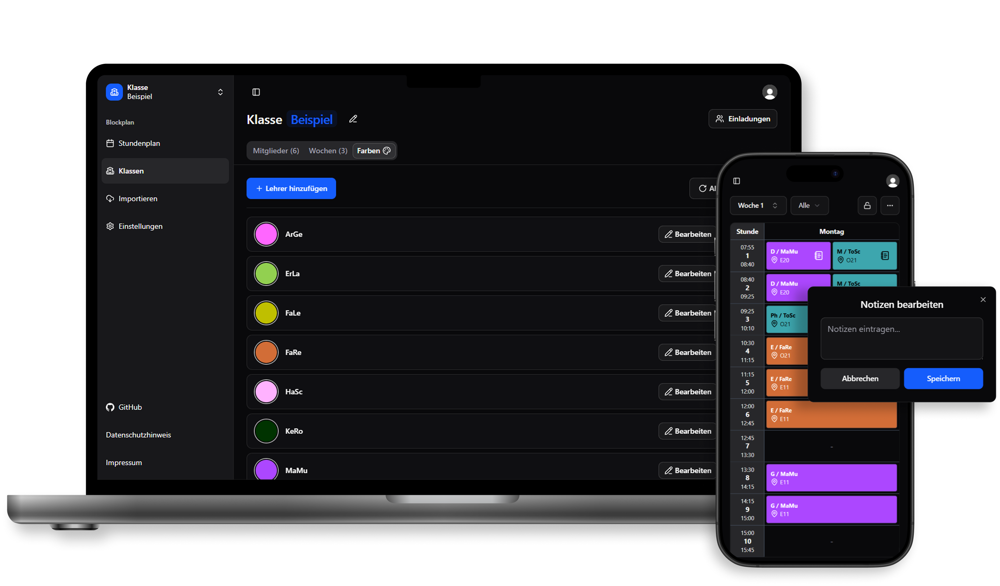

<p align="center">
  
</p>

## Blockplan

A Next.js 16 project with Convex, Clerk, TailwindCSS, and shadcn/ui.

– Stack: Next.js 16, React 19, Bun, Convex, Clerk, Tailwind v4, shadcn/ui
– Folders: App Router under `src/app`, Convex functions under `convex/`, UI in `src/components`

## Prerequisites

- Bun installed (https://bun.sh) — used for scripts
- A Clerk project (Publishable/Secret Key, optional webhook)
- A Convex deployment (URL, Admin Key) or local in Docker (see [self-hosted-convex/docker-compose.yml](./self-hosted-convex/docker-compose.yml))

## Setup

1. Install dependencies

```bash
bun i
```

2. Create your environment

Create `.env.local` (see [ENVIRONMENT_DEV.txt](./ENVIRONMENT_DEV.txt)).
If you manage the environment variables on Vercel, you can use `vercel env pull`.
Use `vercel env pull --help` for help.

## Running locally

If you want to use Docker for hosting Convex locally, you can follow this [Tutorial](https://stack.convex.dev/self-hosted-develop-and-deploy).

Convex and Next.js run in separate processes:

- Terminal A

```bash
bun run convex
```

- Terminal B

```bash
bun run dev
```

Open http://localhost:3000. Clerk protects secured routes via [src/proxy.ts](./src/proxy.ts).

Run the [pdf extracter python service](https://github.com/DaBorsten/timetable_pdf_extractor) to be able to import timetables.

## Useful scripts

- Dev server: `bun run dev`
- Convex dev: `bun run convex`
- Lint: `bun run lint` (or `bun x eslint .`)
- Typecheck: `bun x tsc --noEmit`

## Architecture overview

- Auth: Clerk via proxy; Convex uses `CLERK_JWT_ISSUER_DOMAIN` in `convex/auth.config.ts`
- Data: Convex queries/mutations (see `convex/*.ts`), frontend with `useQuery(api.x.y)` / `useMutation`
- Styling: Tailwind v4; UI components in `src/components/ui` (shadcn)
- State (Zustand):
  - `useClassStore` — current class (`classId`), persistence key `class-storage`, resets week on class change
  - `useWeekStore` — current week (`weekId`), persistence key `week-storage`
  - `useGroupStore` — current group (`group`, 1/2/3), persistence key `group-storage`
  - . . .

## Webhook: Clerk user deletion → Convex cascade

Endpoint: `POST /api/webhooks/clerk`

On `user.deleted`, we locate the Convex user (via `tokenIdentifier = ${CLERK_JWT_ISSUER_DOMAIN}|<clerkUserId>`), hand over or delete owned classes, remove memberships, and delete the user document. This is executed server-side by calling `users.deleteUserByTokenIdentifier` with `CONVEX_ADMIN_KEY`.

Required variables:

```
CLERK_JWT_ISSUER_DOMAIN
CLERK_WEBHOOK_SECRET
CONVEX_ADMIN_KEY
NEXT_PUBLIC_CONVEX_URL
```

Local testing:

1. Expose a public URL via [localtunnel](https://www.npmjs.com/package/localtunnel)
2. Delete a test user in Clerk
3. Watch logs — you should see `User deletion cascade result`

Security: The mutation cannot be called with an end-user identity (`FORBIDDEN`); an admin secret is required and verified.

## Deploy

### Convex

Find the Deployment URL and Deploy Keys in the Convex settings under `URL & Deploy Key`.
Also create two new environment variables in convex:
- CLERK_JWT_ISSUER_DOMAIN
- CONVEX_ADMIN_KEY

### Convex with Clerk

Use Convex with Clerk: https://docs.convex.dev/auth/clerk#nextjs

### Clerk

When using Webhooks, create a new Webhook in the Settings that points to your_website/api/webhooks/clerk with the event type user.deleted.

### Vercel
Use the Vercel CLI to link the project.
In Vercel unter the Build and Deployment setting override the build command with `bunx convex deploy --cmd "bun run build"` to automatically update the convex schema. If you link your github repository, you can just commit to main and it will automatically build your code (based on your settings).

## Project structure (excerpt)

- `src/app` — App Router pages and API routes
- `src/components` — UI and app shell
- `src/store` — Zustand stores (class/week/group)
- `convex/` — Queries/mutations, schema, auth config

## License

BSD 3-Clause — see [LICENSE](./LICENSE)
